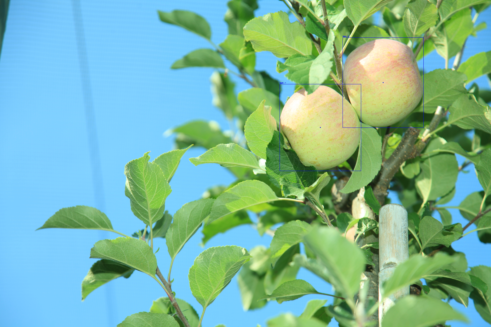

# Apple Detection App : Test PEK Automotive

This Streamlit app detects apples in images using YOLOv8 models. It displays the original image with bounding boxes around detected apples, along with the number of apples detected and their midpoint coordinates.

<video width="320" height="240" controls>
  <source src="extras/app.webm" type="video/webm">
  Your browser does not support the video tag.
</video>

## Features
- Detect apples in images with different YOLO models.
- Display bounding boxes and midpoint coordinates for detected apples.
- Download YOLO models if not already available.
- Supports images in `.png`, `.jpg`, and `.jpeg` formats.

## Requirements
- Python 3.x
- Streamlit
- OpenCV
- Ultralyics YOLO

## How to Run

### Clone the Repository
```bash
    git clone https://github.com/jkcg-learning/test-pek-automotive.git
```
### Navigate to the Project Directory
```bash
cd test-pek-automotive
```
### Install Dependencies
```bash
    pip install -r requirements.txt
```
### Run the Streamlit App
```bash
    streamlit run app.py
```
### Upload an Image
Use the file uploader in the Streamlit app interface to upload an image.

###  Select a Detection Model
Choose a YOLOv8 detection model from the dropdown menu.

### View Results
The app will display the original image with bounding boxes around detected apples, along with the number of apples detected and their midpoint coordinates.


# test-pek-automotive

## sample input 


## sample output


